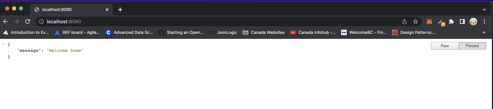

Testing, testing mic :smile.

Hi guys, my first time here, writing my first article. After I've spent 8+ years of experience shipping production software, I think it's the right time to put my experience into writing. So guys, let's go.

In this series of articles, we’ll be implementing social authentication for different social media in a Golang. Below are lists of socials we will be working with.

### Socials
- Tiktok
- Facebook
- Google
- Slack
- Github
- LinkedIn
- Amazon

### Prerequisite:
Before we get started, this tutorial assumes you have:
- A reverse proxy to front our local endpoint (ngrok)
- Basic understanding of Go Language
- You will need Go version 1.11+ installed on your dev machine
- Uber-go/fx framework for dependency injection
- Gin Web Framework

## Tiktok OAuth2 Authentication

This section will guide you on how to enable authentication from the web app to TikTok, in the end, users will be able to authenticate using a Tiktok account. 

Step 1: Create a 
First, let's create a client ID and client secret using its [Tiktok developer](https://developers.tiktok.com/) console.

<p align="center">
    
</p>


#### Setup the Project
First, let us create a directory for our project's code and since we're using Go version 1.11+, we take advantage of modules, no need to put your code under GOPATH. We call our project *socialauth*, so open your terminal and run the following command.

```cmd
mkdir socialauth
cd socialauth
go mod init github.com/samsoft00/socialauth
``` 
Replace *samsoft00* with your Github username or with github.com

#### Build a JSON/HTTP server
Now we'll write our HTTP server using Gin, Gin is an HTTP web framework written in Go (Golang) but before that, we need to set up our dependency injection using uber-go/fx, next, inside our social auth directory, create a folder called *setup*, inside this folder, create a file *config.go* that contains the following code:


```go
package setup

type Config struct {
	ServiceName     string
	CusTomFxOptions []fx.Option
}

func GetOptions() []fx.Option {
	return App(Config{
		ServiceName: "social-login",
		CusTomFxOptions: []fx.Option{
			// controller/service goes here <-
			fx.Provide(),
			fx.Invoke(router.SetupRoutes),
		},
	})
}

func App(config Config) []fx.Option {
	options := []fx.Option{
		fx.Provide(NewZapLogger),
		fx.Provide(SeupGin),
	}

	options = append(options, config.CusTomFxOptions...)
	return options
}

// SeupGin - initialize gin framework
func SeupGin(logger *zap.Logger) *gin.Engine {
	return gin.New()
}

// NewZapLogger -logger
func NewZapLogger() *zap.Logger {
	var logger *zap.Logger
	logger, _ = zap.NewDevelopment()

	return logger
}
``` 
----

```golang
package router

type deps struct {
	fx.In

	GinEngine *gin.Engine
}

func SetupRoutes(d deps) {
	ginEngine := d.GinEngine

	// cors
	ginEngine.Use(cors.New(cors.Config{
		AllowCredentials: true,
		AllowAllOrigins:  true,
		AllowMethods:     []string{"POST"},
		AllowHeaders:     []string{"Origin", "Authorization", "Content-Type", "Content-Length"},
		ExposeHeaders:    []string{"Content-Type", "Content-Length"},
	}))

	go func() {
		_ = http.ListenAndServe(":8080", ginEngine)
	}()
}
``` 
---


```golang
package main

func main() {
	options := setup.GetOptions()
	app := fx.New(options...)
	app.Run()
}
``` 

Let us run the following command to start our server
```cmd
go run main.go
```
Navigate to localhost with port 8080 -> `http://localhost:8080`, your page should look like this



Next, we will spin up Ngrok, which we will be using to test our callback.

To set up ngrok we,

Sign up for a free ngrok account
Install ngrok using the ngrok guide or Run the following commands if it's a macOS

```cmd
brew install ngrok
ngrok authtoken <YOUR_AUTH_TOKEN>
ngrok http 80
```
We will have something similar to what is shown in the image below.
[image here]

Ensure our server is up and running with the ngrok tunnel we just created. Let us navigate to https://f73f-102-89-3-195.ngrok.io on our browser.

<p align="center">
    
</p>

```golang
package tiktok

const (
	NgrokIP = "<NGROK_IP_ADDRESS>" // <- IP address from ngrok
	// -- Extract from Tiktok developer portal - https://developers.tiktok.com
	AuthURL      = "https://open-api.tiktok.com/platform/oauth/connect/"
	TokenURL     = "https://open-api.tiktok.com/oauth/access_token/"
	ClientKey    = "<TIKTOK_CLIENT_KEY>"
	ClientSecret = "<TIKTOK_CLIENT_SECRET>"
	GrantType    = "authorization_code"
	Scope        = "user.info.basic"
	ResponseCode = "code"
)

type config struct {
	BaseURL                 *url.URL
	AuthURL                 *url.URL
	RedirectURL             *url.URL
	TokenURL                *url.URL
	ClientKey, ClientSecret string
	Scopes, GrantType       string
	State, ResponseType     string
}

type Controller struct {
	logger *zap.Logger
	config config
	client *http.Client
}

func NewController(withLogger *zap.Logger) *Controller {
	BaseURL := fmt.Sprintf("https://%s.ngrok.io", NgrokIP)
	RedirectURL := fmt.Sprintf("%s/tiktok/callback", BaseURL)

	return &Controller{logger: withLogger, config: config{
		BaseURL:      parseURL(BaseURL),
		RedirectURL:  parseURL(RedirectURL),
		AuthURL:      parseURL(AuthURL),
		TokenURL:     parseURL(TokenURL),
		ClientKey:    ClientKey,
		ClientSecret: ClientSecret,
		Scopes:       Scope,
		GrantType:    GrantType,
		State:        "vdcm9faw5u",
		ResponseType: ResponseCode,
	},
		client: &http.Client{Timeout: time.Second * 10},
	}
}
``` 

```golang
package router

type deps struct {
	fx.In

	TiktokController *tiktok.Controller // <-
	GinEngine        *gin.Engine
}
...
	{
		t := d.GinEngine.Group("tiktok")

		t.GET("auth", d.TiktokController.Init)
		t.GET("callback", d.TiktokController.Callback)
	}
...
``` 
